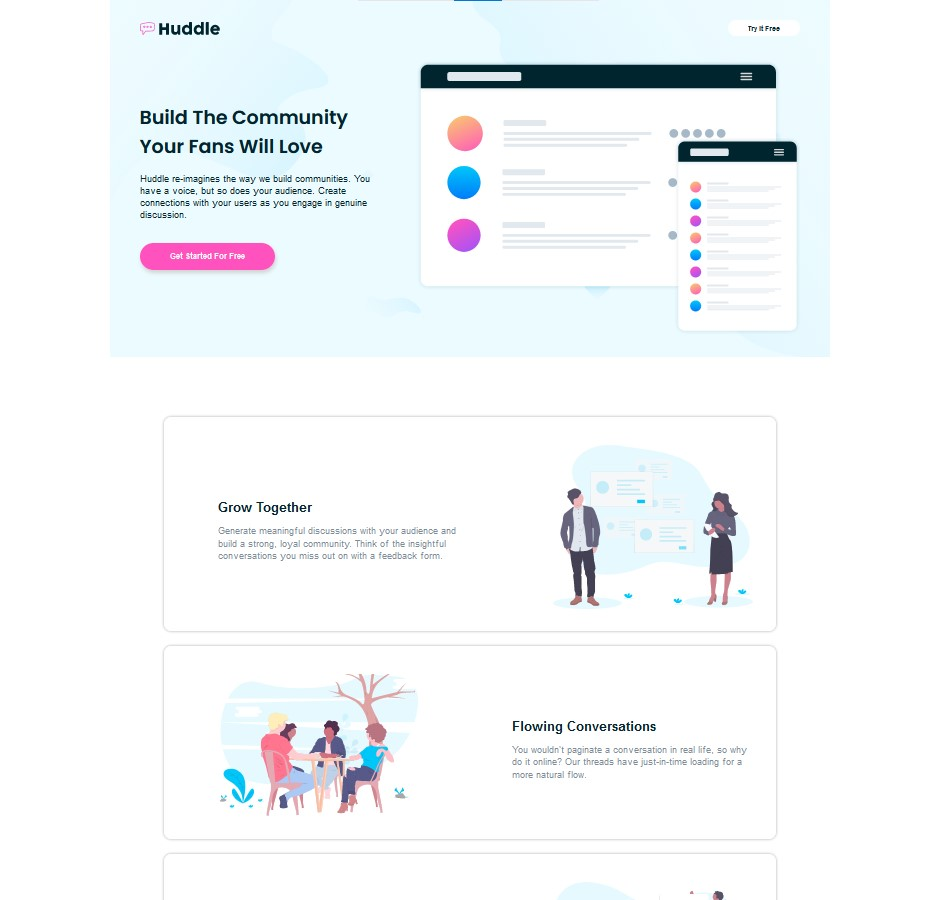
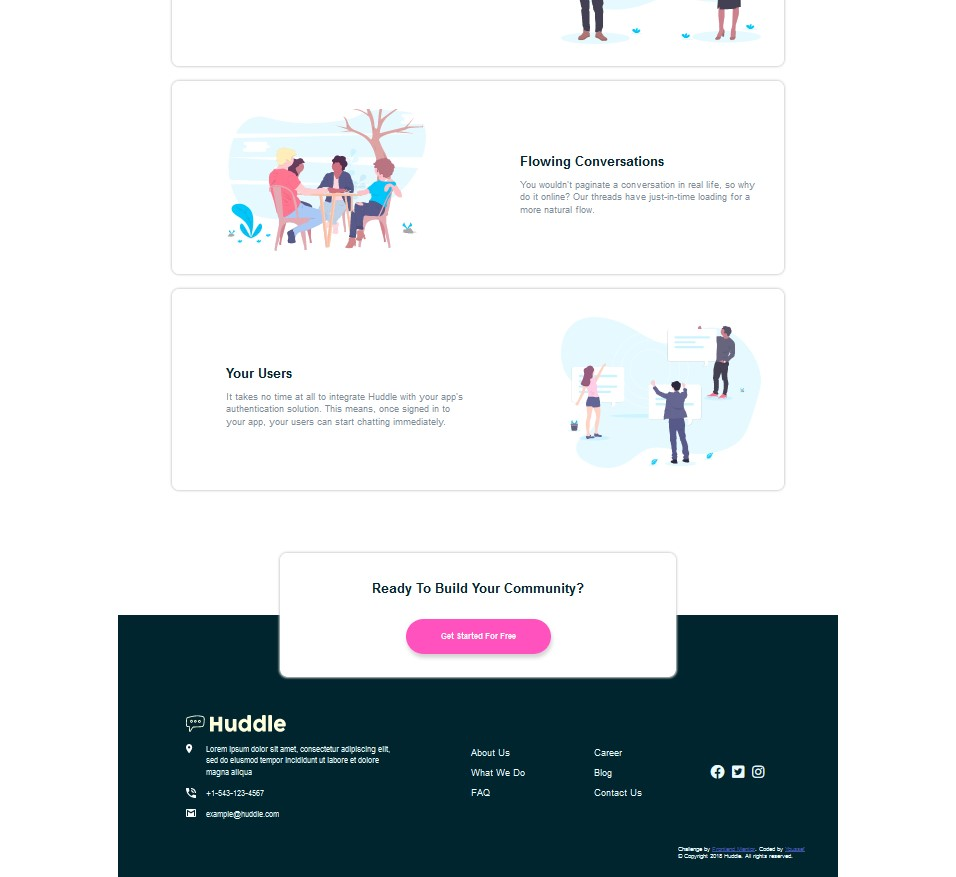
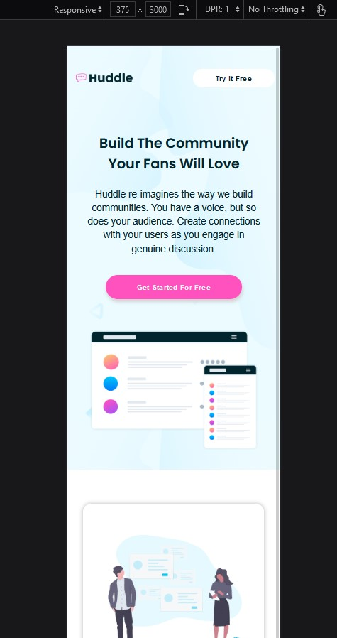
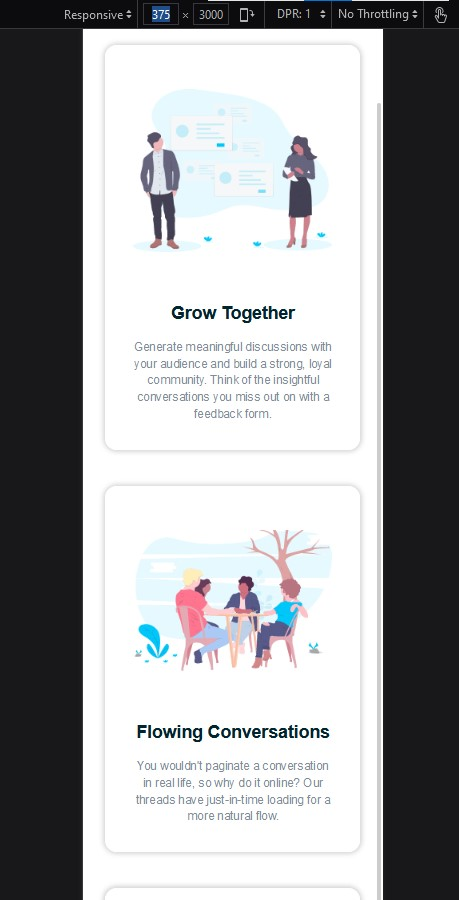
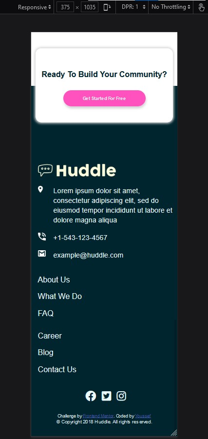

# Frontend Mentor - Huddle-landing-page

## Welcome! 👋

Thanks for checking out this front-end coding challenge.

## Table of contents

- [The challenge](#the-challenge)
- [Screenshot](#screenshot)
- [Links](#links)
- [My process](#my-process)
- [Built with](#built-with)
- [What I learned](#what-i-learned)
- [Continued development](#continued-development)
- [Author](#author)

### The challenge

- Build out the project to the designs provided

### Solution's Screenshots

---

### Links

- Solution URL: (https://drive.google.com/file/d/1G5BUe5ypnsSXrKbB2HaL8Jl8LRn1fX4g/view?usp=sharing) \*
- Live Site URL: (https://youssicode.github.io/Profile-Card-Component/) \*

## My process

### Built with

- Semantic HTML5 markup
- CSS custom properties
- Flex box Layout
- No use of any Framwork
- fontawsome fonts icons
- svg's backgrounds

### What I learned

-Dealing with FlexBox Layout and practicing its properties.
-Responsive Web Design using Media Queries

### Continued development

-Mastering Responsive Web Design.

## Author

- Website - [Youssef](In construction)
- Frontend Mentor - [@youssicode](https://www.frontendmentor.io/profile/youssicode)
- Facebook - (https://www.facebook.com/youssef.elhrouzi)
